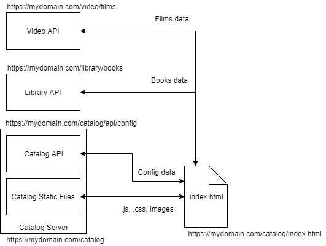
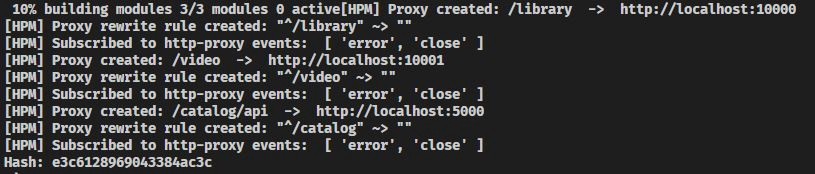
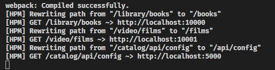

# Angular-CLI-Proxy-Configuration

## Angular CLI 反向代理配置

> 在使用Angular进行本地开发时，与一个或多个后端服务进行链接是非常常见的状况

> 而使用nginx或Kubernetes Ingress这样的反向代理将请求路由到同一域`(domain)`上不同路径后端服务则是应对此种开发场景的常见方案

> 但是因为有了CLI的存在，可以通过简单的配置解决上述问题

## 从例子说起

> 假设存在一个前端坐落于路径`http://mydomain.com/catlog`上

> `Catalog Server`负责提供静态文件`.js，.css，.html`，并提供一个返回环境配置内容的接口给前端



> 还有两个rest 接口, `Video API’`和`Library API`分别坐落于同一`domain`的`/video/`和`/library/`路径上, 这两个接口提供目录页面期望展示的书籍和电影信息

> 再默认的情况下，Angular CLI 假设前端将会服务在基本路径`/`上，比如 CLI 默认在index.html插入`<base href="/">`作为基础路径

> 比如当浏览器加载`https://mydomain.com/catalog/index.html`时, 浏览器将从`https://mydomain.com/main.bundle.js`请求`main.bundle.js`文件，但是这将会导致一个404错误，因为`main.bundle.js`的文件存在于路径`/catalog`上

> 这个问题可以通过指定`base`锚点(`/catlog`)并将其部署与package.json中即可

```json
{
    "start": "ng serve --base-href /catalog/ --deploy-url /catalog/",
    "build": "ng build --prod --base-href /catalog/ --deploy-url /catalog/"
}
```

_通过在`enviornment.ts`和`environment.prod.ts`中配置额外的属性可以解决某些业务API引用的问题`但并不能解决根本的状况`所以并`不推荐`_

> 如果运行`npm run start`可以生成一个带有`<base href ="/ catalog /">`的index.html文件，并可以通过访问`http://localhost:4200/catalog/`访问该页面

> 类似的状况包括对于css文件的引用，如果在使用CSS引用字体或图像等资源时遇到问题可以通过类似的方式尝试设置

> 至此项目已经更加符合期望的服务和前端在生产中的部署结构,但是本地已经开始处理静态文件的Angular CLI还是不清楚如何处理类似于下述请求
- `GET /video/films`
- `GET /library/books`
- `GET /catalog/config`

> 为了处理这些额外的请求必须配置Angular CLI以将其代理至能够理解并提供响应的服务器

> 需要在Angular-CLI项目的根目录中创建一个文件`proxy.conf.json`，内容如下

```json
{
  "/library/*": {
    "target": "http://localhost:10000",
    "secure": false,
    "logLevel": "debug",
    "changeOrigin": true,
    "pathRewrite": {
      "^/library": ""
    }
  },
  "/video/*": {
    "target": "http://localhost:10001",
    "secure": false,
    "logLevel": "debug",
    "changeOrigin": true,
    "pathRewrite": {
      "^/video": ""
    }
  },
  "/catalog/api/*": {
    "target": "http://localhost:5000",
    "secure": false,
    "logLevel": "debug",
    "changeOrigin": true,
    "pathRewrite": {
      "^/catalog": ""
    }
  }
}
```

1. `changeOrigin`属性用于后端服务与前端存在跨域时，设置为true
2. `logLevel`属性用于调试代理是否正常工作(属性包括:`debug,info,warn,error,silent`,默认为`info`)
> 除此之外，还需要更新`package.json`以在本地运行时引用此文件

```json
{
    "start": "ng serve --base-href /catalog/ --deploy-url /catalog/ --proxy-config proxy.conf.json",
}
```

> _或者可以通过将`proxyConfig`导入`angular.json`文件中的方式_

```json
"architect": {
  "serve": {
    "builder": "@angular-devkit/build-angular:dev-server",
    "options": {
      "browserTarget": "your-application-name:build",
      "proxyConfig": "proxy.conf.json"
    }
```

> 现在运行`npm run start`指令(或`ng serve`)，命令行将会展示之前的代理设置



> 现在在浏览器内前进到`http://localhost:4200/catalog/`, 从命令行中可以观察到数个被代理到其他服务的请求



- 发往`http://localhost:4200/library/books`的请求被代理到`http://localhost:10000/books`
> 因为配置要求任何匹配`/library/*`的路径定向到`http://localhost:10000`服务器;除此之外，`pathRewrite`属性需要改所有满足`^/library`的路径:替换`^/library`为`''`

```
http://localhost:4200/library/books -> http://localhost:4200/books
```

- 相似的代理状况发生在`http://localhost:4200/catalog/api/config`, `pathRewrite`属性为:`^/catalog/api/*: ""`,故而

```
http://localhost:4200/catalog/api/config -> http://localhost:5000/api/config
```

## 一些例外的情况

### 代理多个条目到同一目标server

> 需要在`proxy.conf.js`中定义配置而不是`proxy.conf.json`中

```javascript
const PROXY_CONFIG = [
    {
        context: [
            "/my",
            "/many",
            "/endpoints",
            "/i",
            "/need",
            "/to",
            "/proxy"
        ],
        target: "http://localhost:3000",
        secure: false
    }
]

module.exports = PROXY_CONFIG;
```

> 同样的，需要在`angular.json`文件中正确引入js文件

```json
"architect": {
  "serve": {
    "builder": "@angular-devkit/build-angular:dev-server",
    "options": {
      "browserTarget": "your-application-name:build",
      "proxyConfig": "proxy.conf.js"
    }
```

### 需要绕过代理，或在请求发送之前动态更改请求

```javascript
const PROXY_CONFIG = {
    "/api/proxy": {
        "target": "http://localhost:3000",
        "secure": false,
        "bypass": function (req, res, proxyOptions) {
            if (req.headers.accept.indexOf("html") !== -1) {
                console.log("Skipping proxy for browser request.");
                return "/index.html";
            }
            req.headers["X-Custom-Header"] = "yes";
        }
    }
}

module.exports = PROXY_CONFIG;
```

### 使用企业代理

_存疑_

> 常规配置下，在企业代理中尝试将请求代理到本地网络之外的任何URL将会失败

> 在这种情况下，可以配置后端代理使用一个代理人通过公司的代理重定向请求，需要安装`https-proxy-agent`包并配置

```bash
npm i --save-dev https-proxy-agent
```

```javascript
var HttpsProxyAgent = require('https-proxy-agent');
var proxyConfig = [{
  context: '/api',
  target: 'http://your-remote-server.com:3000',
  secure: false
}];

function setupForCorporateProxy(proxyConfig) {
  var proxyServer = process.env.http_proxy || process.env.HTTP_PROXY;
  if (proxyServer) {
    var agent = new HttpsProxyAgent(proxyServer);
    console.log('Using corporate proxy server: ' + proxyServer);
    proxyConfig.forEach(function(entry) {
      entry.agent = agent;
    });
  }
  return proxyConfig;
}

module.exports = setupForCorporateProxy(proxyConfig);
```

> 当定义了http_proxy或HTTP_PROXY环境变量之后，运行时代理人将会自动添加到请求上并通过企业代理
